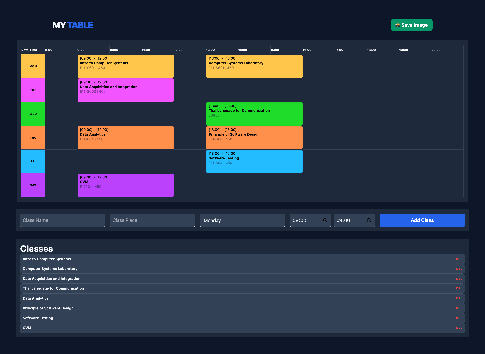
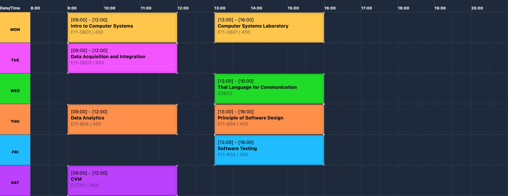

   # MyTable

A lightweight, browser-based **Weekly Schedule Generator** 

## Features




- **Real time input**: enter the data with standards clock picker, the app handle the math
- **Conflict Prevention**: Automatically removes underlying grid cells when a class block "spans" across multiple hours
- **Color-Coded**: each day have the color coded for easier read
- **Image Export**: One-click export to PNG using html2canvas with 3x scaling for high-definition results.
- **Upload text file**: Save and download text file for easier fixation and easier adding classes

### future feature
- **Dark mode/Light mode**: now the dark mode is default because I prefer so
- **Connect to the University data**: being KUtable2 hehe

## Getting Started

1. download/clone this repository
  ```bash
  git clone https://github.com/LylatierN/MyTable.git
  ```
2. Open `index.html` on any browser (suggestion, Chrome)
3. READY TO GO!
   - Add Schedule: Enter a name, place, day, time then click `Add class`
   - To Delete: click `del` button on the list below
   - To Save Image: click `📸Save Image` button to get the PNG
   - To Save Text: click `💾 Download .txt` to get text file

Note: try using the 80-100% fullscreen desktop for the best result

### File Upload
  The file must be txt file in format below
  ```
  classname, day (MON, TUE), start time (ex. 09:00), end time, place(optional)
  ```

  or you can look at the [mock data](mockData.txt) for more example


## Project Structure
```
├── index.html       # The main interface and structure
├── script.js        # Grid logic, time-to-slot math, and rendering
├── style.css        # extra styling
├── mockData.txt       # mock text data
└── README.md        # Documentation
```


## Tech Stack

- HTML/CSS/JavaScript
- tailwindCSS
- html2canvas

## Technical highlight
- ### Time-to-Slot Conversion
    The grid starts at 08:00 AM. Each 30-minute block is a single unit. The conversion follows this formula:
    $$\text{Slot Index} = (\text{Hour} - 8) \times 2 + (\text{if minutes} \ge 30 \text{ then } 1 \text{ else } 0)$$

- ### Grid Spanning
    The app uses grid-column: span X to allow classes to cover their specific durations dynamically while maintaining the grid's alignment by removing overlapping empty div elements.

    <br>the grid hold the 26+1(corner) grid from 8.00 - 20.00

---
## DEV NOTE:
This project is for personal use, does not do the good debug or any clean up